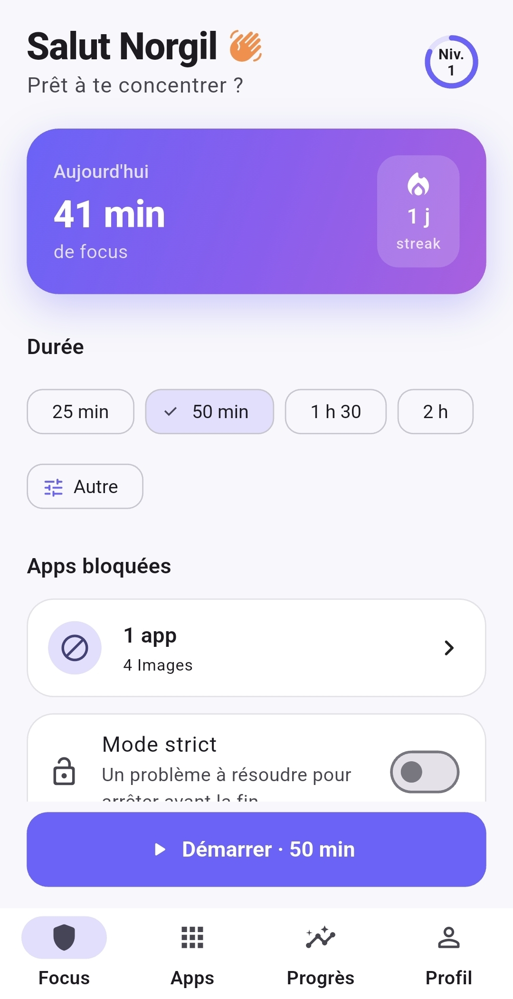

# ResteFocus

**Reste concentré. Débloque ton potentiel.**

ResteFocus est une application Android qui bloque tes apps distrayantes pendant tes sessions de travail. Pour débloquer une app, il faut d'abord résoudre un problème — maths, physique, algo, électronique, stats, réseaux, ou culture & tech Afrique. Chaque tentative de distraction devient un moment d'apprentissage au lieu d'un simple interdit.

<p align="center">
  
</p>

## Fonctionnalités

- **Sessions de focus** avec blocage natif des apps choisies (Android `AccessibilityService`), durée réglable via un cadran circulaire ou des présélections rapides
- **Math Gate** natif : s'affiche instantanément à l'ouverture d'une app bloquée, sans dépendre du moteur Flutter. Problèmes générés à la volée dans 7 matières, avec plusieurs variantes par niveau de difficulté
- **Culture & Tech Afrique** : une matière à part entière — calculs mis en situation (coût data, énergie solaire, couverture réseau, objectifs du PND...), jamais de dates ou chiffres historiques inventés
- **Citations** de scientifiques et philosophes affichées pendant l'effort et la pause après plusieurs échecs
- **Carnet d'erreurs** : les problèmes ratés reviennent en révision espacée jusqu'à être répondus correctement deux fois de suite
- **Mode strict** : impossible d'arrêter une session sans résoudre un problème
- **Gamification** : XP, niveaux, streak quotidien
- **Tableau de progrès** : temps de focus, taux de réussite au Math Gate, graphe des 7 derniers jours
- **Widget écran d'accueil** : état de la session et streak visibles sans ouvrir l'app

## Stack technique

- **Flutter / Dart** pour l'interface et la logique applicative (state management avec Riverpod)
- **Kotlin natif** pour tout ce qui doit réagir instantanément ou survivre à l'app Flutter : service d'accessibilité, overlay du Math Gate, widget écran d'accueil — communication via `MethodChannel`
- **Stockage 100 % local** : `shared_preferences` côté Flutter, `SharedPreferences` natif côté Kotlin. Aucune donnée envoyée à un serveur.

## Structure du projet

```
lib/
  core/            constantes, thème, formatage, widgets partagés (dont le cadran de durée)
  data/            modèles et persistance locale (JSON + shared_preferences)
  features/        un dossier par écran (screens/) et sa logique (providers/)
  services/        pont Flutter <-> Kotlin (MethodChannel)
android/app/src/main/kotlin/.../
  FocusAccessibilityService.kt   détection des apps bloquées
  MathGateActivity.kt            écran de blocage natif
  NativeProblemGenerator.kt      génération des problèmes côté Kotlin
  FocusWidgetProvider.kt         widget écran d'accueil
  SessionPrefs.kt                état de session partagé entre les composants natifs
```

## Démarrage

Prérequis : [Flutter SDK](https://docs.flutter.dev/get-started/install) (channel stable) et un SDK Android.

```bash
git clone https://github.com/5yn0r/ResteFocus.git
cd ResteFocus
flutter pub get
flutter run
```

Au premier lancement, l'app demande deux permissions Android indispensables au blocage : l'accessibilité (détecte l'ouverture d'une app bloquée) et la superposition (affiche le Math Gate par-dessus). Les deux se configurent depuis l'écran d'onboarding ou l'onglet Profil.

## Cahier des charges

Le contexte du projet, les spécifications détaillées et la roadmap sont documentés dans [Writer.md](Writer.md).
